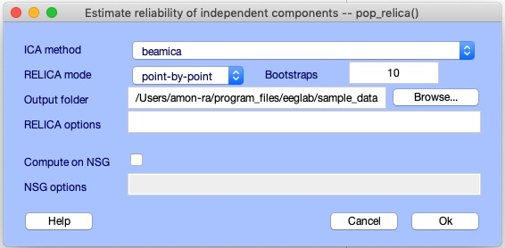
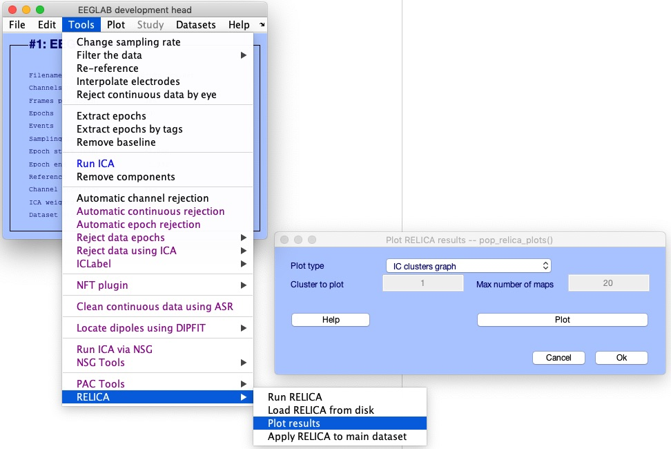
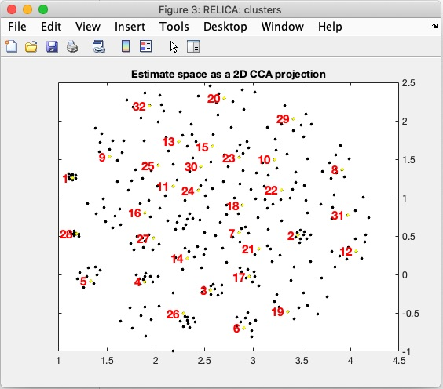
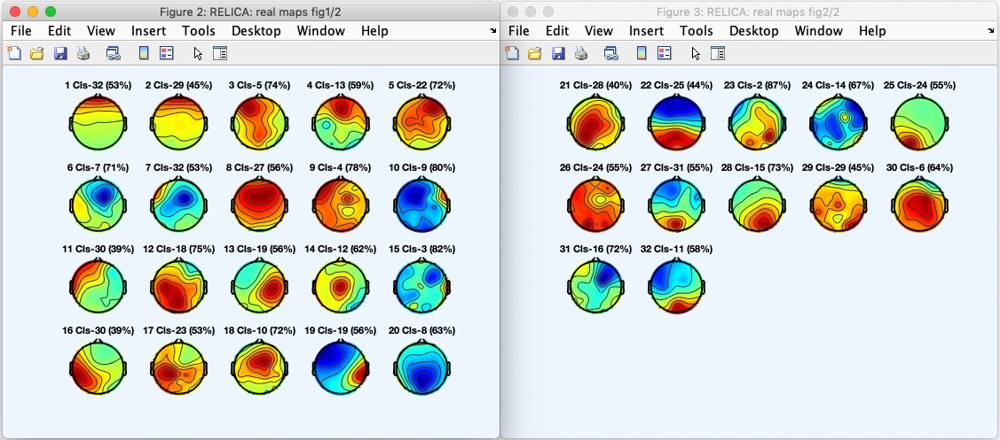
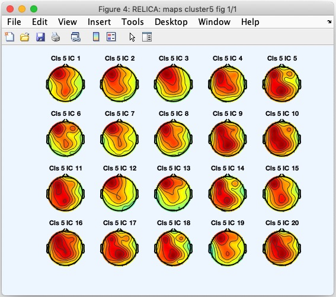

# RELICA plug-in to EEGLAB

## What is RELICA
Independent Component Analysis (ICA) is a widely applied data-driven method for parsing brain and non-brain
EEG source signals, mixed by volume conduction to the scalp electrodes, into a set of maximally temporally and
often functionally independent components (ICs). Many ICs may be identified with a precise physiological or
non-physiological origin. However, this process is hindered by partial instability in ICA results that can arise
from noise in the data. Here we propose RELICA (RELiable ICA), a novel method to characterize IC reliability
within subjects. RELICA first computes IC “dipolarity” a measure of physiological plausibility, plus a measure of
IC consistency across multiple decompositions of bootstrap versions of the input data. RELICA then uses these
two measures to visualize and cluster the separated ICs, providing a within-subject measure of IC reliability
that does not involve checking for its occurrence across subjects. RELICA might be used with any linear
blind source separation algorithm to reduce the risk of basing conclusions on unstable or physiologically
un-interpretable component processes.

## Installing the RELICA plug-in to EEGLAB
All plug-ins in EEGLAB, included RELICA, can be installed following two different ways. For installing RELICA:

From the EEGLAB Plug-in Manager: Launch EEGLAB and go to File -> Manage EEGLAB extension. The plug-in manager GUI will pop up. From this GUI look for and select the plug-in RELICA from the main window, then click into the Install/Update button to install the plug-in.

From the web: Download the zip file with the content of the plug-in RELICA*either from [this](https://github.com/sccn/relica) GitHub page (select Download Zip on Github) or from the EEGLAB wiki page for plug-ins [here](https://sccn.ucsd.edu/wiki/Plugin_list_all). Decompress the zip file in the folder ../eeglab/plug-ins and the restart EEGLAB. If the installation is successful, the plug-in RELICA can be found from the EEGLAB main GUI at Tools > RELICA


## Executing RELICA
### Running RELICA on your local computer resource (desktop/laptop)
Before executing RELICA, load the EEG data where RELICA wants to be computed. In this example we will use a sample EEGLAB dataset, located in *../eeglab/sample_data/eeglab_data_epochs_ica.set*. Then, to run RELICA on the loaded data, first launch the main RELICA GUI, either by typing *relica* in the MATLAB command windows or from the EEGLAB main GUI by clicking **Tools > RELICA > Run RELICA**. The figure below shows the main GUI of RELICA. 


From this GUI we can specify (see in **bold** the corresponding GUI element):

1. The ICA method to use (**ICA Method**)
2. The way RELICA perform the bootstrapping. This can be either point-by-point or in the case of epoched data, trial-by-trial (**RELICA mode**)
3. Number of bootstraps to perform (**Boostraps**)
4. Define the path to save RELICA result file (**Output folder**)
5. Define RELICA options not specified in the GUI like, e.g., ICA options  (**RELICA options**)
6. Option to perform the RELICA computation at the Neurosciences Gateways (NSG) (**Compute on NSG**)
7. Define NSG options (**NSG options**)
8. Access to help documentation (**Help**)

In the example shown here, we will select the ICA method BEAMICA and set the number of bootstraps to 10. Then we will set the path to save RELICA results to the same folder where the data is saved ( *../eeglab/sample_data/*). We will use the rest of the defaults options, as indicated in the figure below.

 
 
 Then we proceed to run RELICA locally (not at NSG) by clicking the button **OK**.
 
### Running RELICA on NSG
The bottleneck in the processing performed by RELICA is the recursive computation of ICA using bootstrapped sections of the data. Depending on the size of the data, this process may be computationally very expensive. Although this part of the processing is parallelized, we can take advantage of the use of NSG. We have included code developed under the project *The Open EEGLAB Portal* into RELICA  to perform this costly part of the RELICA processing in NSG. The processing is managed from the same *pop\_relica* GUI showed above.
 To perform RELICA computation in NSG **_you must have an NSG account_** and have the EEGLAB plug-in [*nsgportal*](https://github.com/sccn/nsgportal/) already installed and set in your computer. Take a look into the [*nsgportal* wiki](https://github.com/sccn/nsgportal/wiki) for more details on these steps.
 Once *nsgportal* is installed and set in your computer, you can easily enable RELICA computation in NSG by checking the checkbox **Compute on NSG**.  Additional NSG parameters, like the requested running time and *jobID*, can be set in the edit **NSG options** in the same GUI. For more options, you can check *pop\_relica* help documentation. To run RELICA with these settings, then click the button **OK**. If no *jobID* was provide as NSG option, *pop\_relica* would assign a default on consisting on the prefix 'relicansg_' combined with a six digits random generated number (e.g., relicansg_123456).  This *jobID* will be printed in the MATLAB command windows after initiated RELICA computation. 
  To track the status of the job you may refer to *pop\_nsg* GUI and locate your job using the *jobID* assigned to the relica task.

## Retrieving RELICA results
There are three ways of accessing RELICA results:

1. In the same EEGLAB session as to where the RELICA execution was initiated, if the option to run on NSG is not set, RELICA results will be stored in *EEG.etc.RELICA*
2. RELICA results can be loaded into an EEG set by following Tools > RELICA > Load RELICA from disk and then selecting the RELICA.mat file corresponding to the set loaded.
3. If the NSG option was used and the job execution its already finished (see how to check the status [here](https://github.com/sccn/nsgportal/wiki/nsgportal-graphical-user-interface:-pop_nsg)) use the *jobID* of your task to retrieve the results. For example if the *jobID* is *relicatest_data* you may use ```EEG = pop_relica('relicatest_data');```. 

After performing any of these steps, RELICA results will be stored in the EEG data structure, specifically, in *EEG.etc.RELICA*.

## Visualizing RELICA results
Once the computation in RELICA is done and the results are retrieved, we can visualize the results using three types of plots, as in the menu **Plot type** in the *pop\_relica_plots* GUI (see figure below for GUI)



#### Plot type 1: Clusters graph plot
Here we will generate a  plot with the clusters of all IC maps from all ICA computations in a reduced dimensional space. For this, select the option *IC clusters graph* from the menu **Plot type** in *pop\_relica\_results* and then click the button **Plot**. A figure like the one below will pop up.




#### Plot type 2 :Real IC maps
With Real IC maps, we refer to the stable IC obtained from the RELICA process. These ICs are depicted in the figure of the *Cluster graph plots* with a yellow dot, meaning also that represents the centroid of the cluster.
 To generate this figure, select the option *Real IC maps* from the menu **Plot type** in *pop\_relica\_results* and then click the button **Plot**. A figure like the one below will pop up.
 


#### Plot type3: Cluster bootstraps maps
 To explore the elements on each of the clusters in the figure *Cluster graph plots*, we can select the option *Cluster bootstraps maps* and then define the cluster to plot (in edit **Cluster to plot**) and the maximum number of elements(IC maps) from the cluster to plot (in edit **Max number of mapx**). Click **Plot** to display the figure below.
 
 
